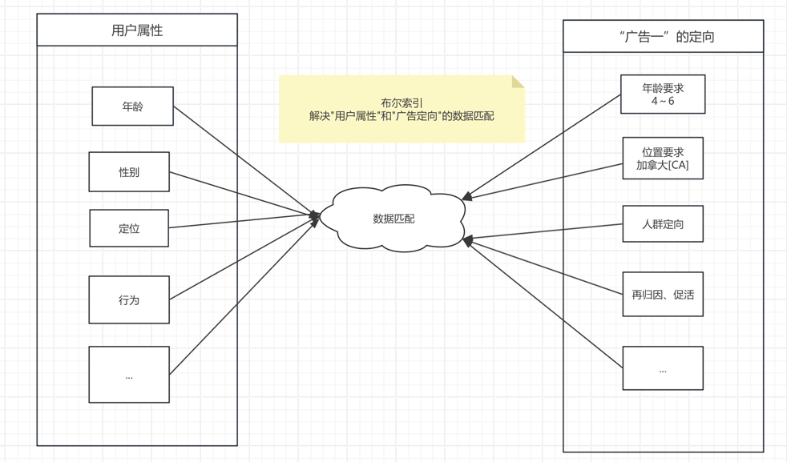
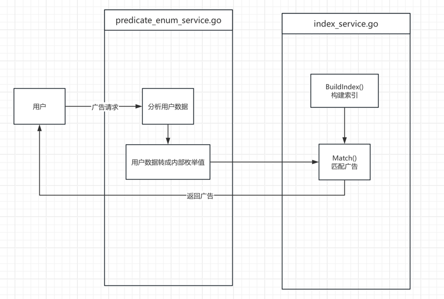
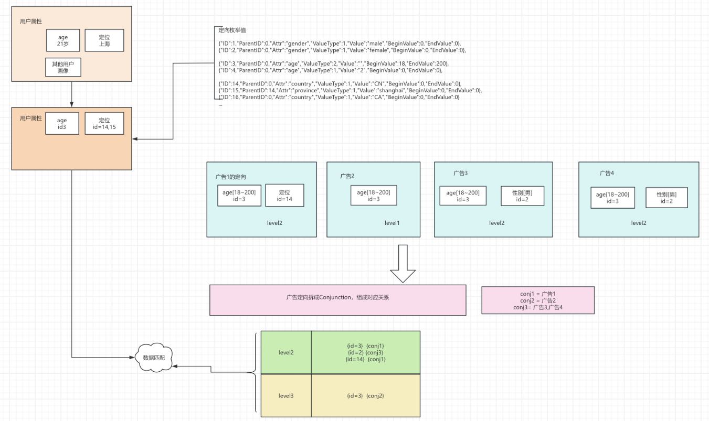

# ads-bool-indexer

# 布尔索引解决的问题

"广告定向"与"用户属性"之间的数据匹配

# ads-bool-indexer 项目说明

### ad_model 广告模型

    ad.go 简易版广告模型
    predicate_value.go 广告定向模型

### index_model 索引模型

    dnf.go 索引基础模型
    indexer.go 索引模型

### service 业务逻辑
    index_service.go 索引服务
    posting_service.go 匹配算法
    predicate_enum_service.go 用户属性转换

### 逻辑图

# 布尔索引简介

